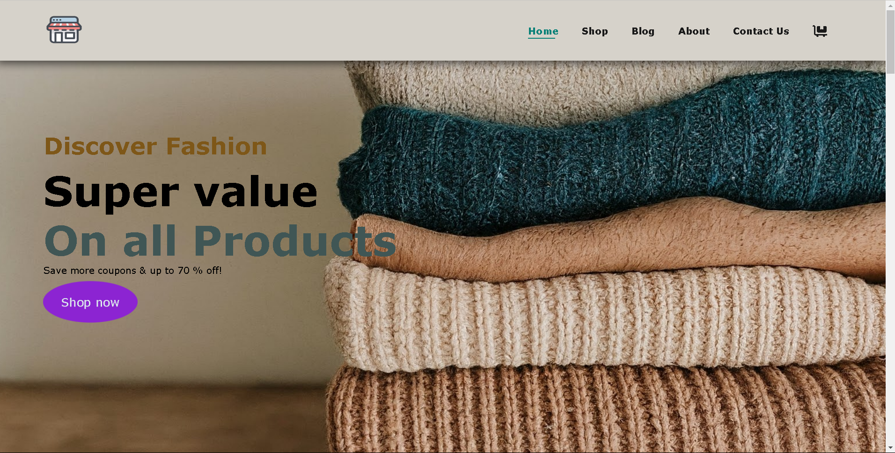
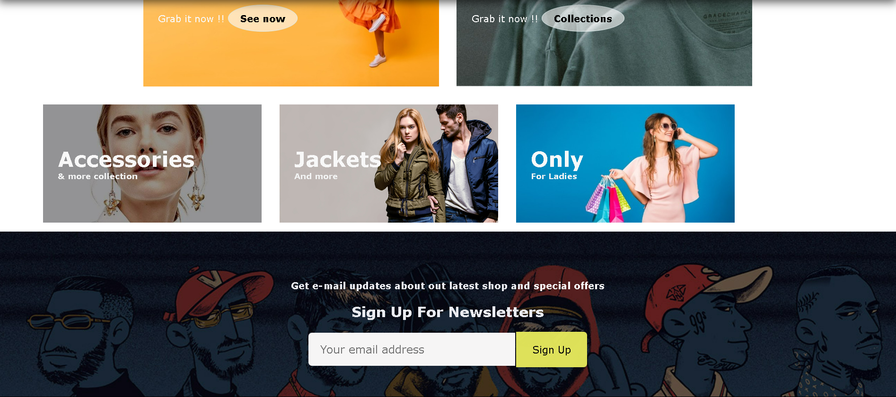

# E-Commerce-Site-html-css-
Building an E-Commerce site using only HTML and CSS


Here's a sample README file for the "Magic Moments" shopping website, including explanations of the main sections and functions of the website. You can include the three screenshots where relevant, such as for the hero section, product section, and features section.

---

# Magic Moments Shopping Website

## Overview

Magic Moments is an e-commerce website focused on providing users with a seamless shopping experience for fashion products. The website is designed to be visually appealing and user-friendly, with an emphasis on modern design and ease of navigation.

## Features

- **Responsive Design**: The website is fully responsive and adapts to different screen sizes, providing a great user experience on both mobile and desktop devices.
- **Product Display**: Users can browse through a variety of fashion products, view details, and add items to their cart.
- **Promotional Banners**: The site features promotional banners highlighting discounts and special offers.
- **Navigation**: A clear and simple navigation menu allows users to easily explore different sections of the site, including the home page, shop, blog, about, and contact us pages.
- **Hero Section**: The hero section features a call-to-action with a prominent "Shop Now" button, encouraging users to start shopping immediately.

## Technologies Used

- **HTML5**: The structure of the website is built using HTML5, ensuring semantic and accessible markup.
- **CSS3**: The styling of the website is done using CSS3, with additional features like Flexbox for layout, transitions, and hover effects.
- **Font Awesome**: Icons are implemented using Font Awesome to enhance the visual appeal of the site.
- **Google Fonts**: Custom fonts from Google Fonts are used to maintain a consistent and modern typographic style.

## Sections

### 1. Header
The header section contains the website's logo, navigation menu, and cart icon. It also includes a hamburger menu for mobile screens to toggle the navigation.

### 2. Hero Section
The hero section is designed to attract users with a prominent heading, subheading, and call-to-action button. This section introduces the user to the site's main purpose – discovering fashion products.



### 3. Features Section
This section highlights the key features of the website, such as free shipping, online ordering, and 24/7 support. Each feature is represented with an icon and brief text.


### 4. Product Sections
The product sections showcase various products available on the site. The products are displayed in a grid layout, with each product featuring an image, brand name, title, price, and a buy icon. Users can click on the cart icon to add products to their shopping cart.

#### - Featured Products
This section highlights specific products that are on promotion or are popular among customers.

#### - New Arrivals
This section displays the latest products added to the store.



### 5. Off-Banner Section
The off-banner section promotes current sales or discounts available on the site, encouraging users to explore more products and take advantage of special offers.

### 6. Footer
The footer contains links to various pages like the shop, blog, about, and contact pages, as well as social media icons for connecting with the brand on platforms like Facebook, Twitter, and Instagram.

## How to Run

1. **Clone the repository**:
   ```bash
   git clone https://github.com/yourusername/magic-moments.git
   ```
2. **Navigate to the project directory**:
   ```bash
   cd magic-moments
   ```
3. **Open the `index.html` file in your web browser** to view the website.

## Future Enhancements

- **Integration with a backend system** for handling product management, user authentication, and payment processing.
- **Search functionality** to allow users to quickly find products they are interested in.
- **User account system** to enable users to create accounts, track orders, and save favorite products.

---

